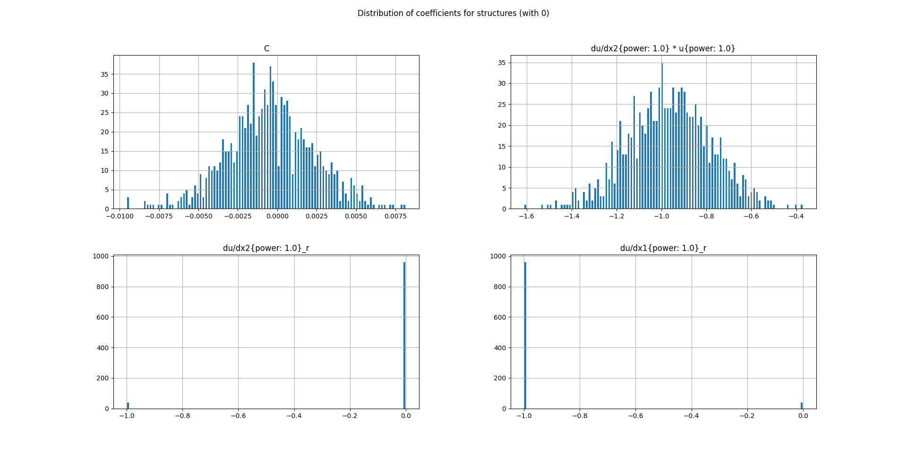

# EBS (EPDE - BAMT - SOLVER)

---
Программный компонент реализующий алгоритм
устойчивого обучения модели в виде дифференциального уравнения.
---
Программный компонент включает в себя объединение 3-х фреймворков (модулей):

+ EPDE (Evolutionary Partial Differential Equations) (https://github.com/ITMO-NSS-team/EPDE) - фреймворк для определения диффиренциальных уравнений, 
которые описывают динамические системы, на основе временных рядов, или полей измерений.
+ BAMT (Bayesian Analytical and Modelling Toolkit) (https://github.com/ITMO-NSS-team/BAMT) - фреймворк для обучения байесовских сетей.
+ TEDEouS (Torch Exhaustive Differential Equation Solver) (https://github.com/ITMO-NSS-team/torch_DE_solver) - 
фреймворк автоматизированного решения дифференциальных уравнений.
---


---
## Пример использования
Перед тем как запустить программный компонент необходимо настроить конфигурацию каждого модуля. Это осуществляется в `func/load_data.py`:

```Python
    def example_equation():
    """
        path -> data -> parameters -> derivatives (optional) -> grid -> 
        -> boundary conditions (optional) -> modules config (optional)
    """
    path = """YOUR CODE HERE"""
    data = """YOUR CODE HERE"""

    derives = None  # if there are no derivatives

    grid = """YOUR CODE HERE"""
    param = """YOUR CODE HERE"""

    bconds = False  # if there are no boundary conditions

    noise = False
    variance_arr = ["""YOUR CODE HERE"""] if noise else [0]

    global_modules = {
        "global_config": {
            "discovery_module": "EPDE",
            "dimensionality": data.ndim
        }
    }

    epde_config = {"""YOUR CODE HERE"""}

    bamt_config = {"""YOUR CODE HERE"""}

    solver_config = {"""YOUR CODE HERE"""}

    config_modules = {**global_modules,
                      **epde_config,
                      **bamt_config,
                      **solver_config}

    with open(f'{path}config_modules.json', 'w') as fp:
        json.dump(config_modules, fp)

    cfg_ebs = config.Config(f'{path}config_modules.json')

    return data, grid, derives, cfg_ebs, param, bconds
```

Конфигурация по умолчанию и соответствующие параметры каждого модуля можно посмотреть в `default_configs.py`. После этого добавляются указания о задаче в основной файл `ebs_main.py`:

```Python
tasks = {
    'wave_equation': load_data.wave_equation,
    'burgers_equation': load_data.burgers_equation,
    'KdV_equation': load_data.KdV_equation
}

title = list(tasks.keys())[1]  # name of the problem/equation
```

### Результаты

<details>
<summary>1. Волновое уравнение с одной пространственной переменной (подробнее)</summary>
<br>

$$ \frac{\partial^{2} u}{\partial t^{2}} - \frac{1}{25} \frac{\partial^{2} u}{\partial x^{2}} = 0, $$

$$ \\ 100\times100, x \in [0; 1], t \in [0; 1].$$

Выход модуля `EPDE` представляется в виде таблицы. Полями в таблице являются структуры полученных ДУЧП, где каждая строка содержит коэффициенты при каждой структуре. 

Эти данные поступают на вход в модуль `BAMT` для построения на их основе байесовской сети. 
Результатами работы модуля являются: 
* распределение коэффициентов при структурах (иллюстрируется на рисунке ниже) 


* список сэмплированных ДУЧП, который, в свою очередь, является входом для модуля `SOLVER`.

Полученные поля решений ДУЧП используются для построения доверительной области и усредненного решения. Результаты для сравнения отображаются с исходными данными и в виде тепловых карт.


</details>

<details>
<summary>2. Невязкое уравнение Бюргерса</summary>
<br>

$$ \frac{\partial u}{\partial t} +  u \frac{\partial u}{\partial x} = 0, $$

$$ \\ 256\times256, x \in [-4000; 4000], t \in [0; 4]. $$




</details>


---
